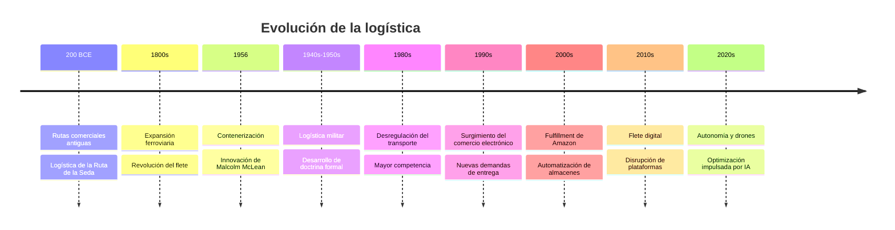

```mermaid
timeline
    title Evolución de la logística
    200 BCE : Rutas comerciales antiguas
            : Logística de la Ruta de la Seda
    1800s : Expansión ferroviaria
          : Revolución del flete
    1956 : Contenerización
         : Innovación de Malcolm McLean
    1940s-1950s : Logística militar
                : Desarrollo de doctrina formal
    1980s : Desregulación del transporte
          : Mayor competencia
    1990s : Surgimiento del comercio electrónico
          : Nuevas demandas de entrega
    2000s : Fulfillment de Amazon
          : Automatización de almacenes
    2010s : Flete digital
          : Disrupción de plataformas
    2020s : Autonomía y drones
          : Optimización impulsada por IA
```
