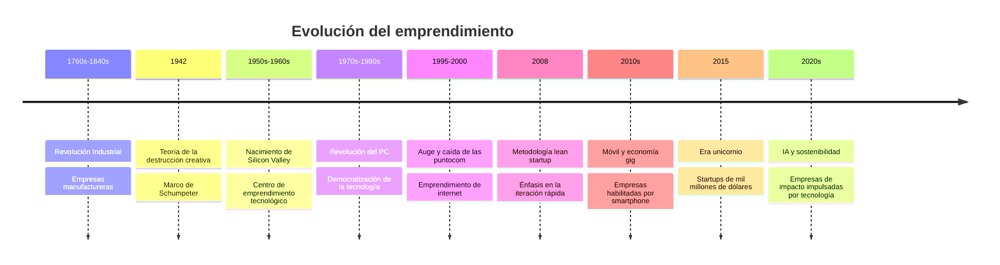

```mermaid
timeline
    title Evolución del emprendimiento
    1760s-1840s : Revolución Industrial
                : Empresas manufactureras
    1942 : Teoría de la destrucción creativa
         : Marco de Schumpeter
    1950s-1960s : Nacimiento de Silicon Valley
                : Centro de emprendimiento tecnológico
    1970s-1980s : Revolución del PC
                : Democratización de la tecnología
    1995-2000 : Auge y caída de las puntocom
              : Emprendimiento de internet
    2008 : Metodología lean startup
         : Énfasis en la iteración rápida
    2010s : Móvil y economía gig
          : Empresas habilitadas por smartphone
    2015 : Era unicornio
         : Startups de mil millones de dólares
    2020s : IA y sostenibilidad
          : Empresas de impacto impulsadas por tecnología
```
