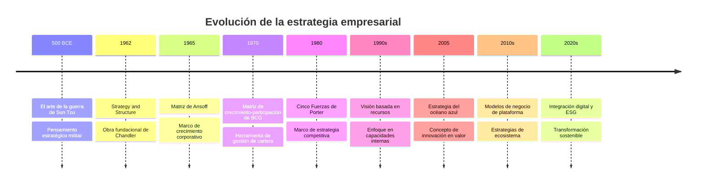

```mermaid
timeline
    title Evolución de la estrategia empresarial
    500 BCE : El arte de la guerra de Sun Tzu
            : Pensamiento estratégico militar
    1962 : Strategy and Structure
         : Obra fundacional de Chandler
    1965 : Matriz de Ansoff
         : Marco de crecimiento corporativo
    1970 : Matriz de crecimiento-participación de BCG
         : Herramienta de gestión de cartera
    1980 : Cinco Fuerzas de Porter
         : Marco de estrategia competitiva
    1990s : Visión basada en recursos
          : Enfoque en capacidades internas
    2005 : Estrategia del océano azul
         : Concepto de innovación en valor
    2010s : Modelos de negocio de plataforma
          : Estrategias de ecosistema
    2020s : Integración digital y ESG
          : Transformación sostenible
```
