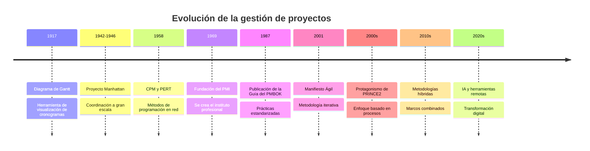

```mermaid
timeline
    title Evolución de la gestión de proyectos
    1917 : Diagrama de Gantt
         : Herramienta de visualización de cronogramas
    1942-1946 : Proyecto Manhattan
              : Coordinación a gran escala
    1958 : CPM y PERT
         : Métodos de programación en red
    1969 : Fundación del PMI
         : Se crea el instituto profesional
    1987 : Publicación de la Guía del PMBOK
         : Prácticas estandarizadas
    2001 : Manifiesto Ágil
         : Metodología iterativa
    2000s : Protagonismo de PRINCE2
          : Enfoque basado en procesos
    2010s : Metodologías híbridas
          : Marcos combinados
    2020s : IA y herramientas remotas
          : Transformación digital
```
