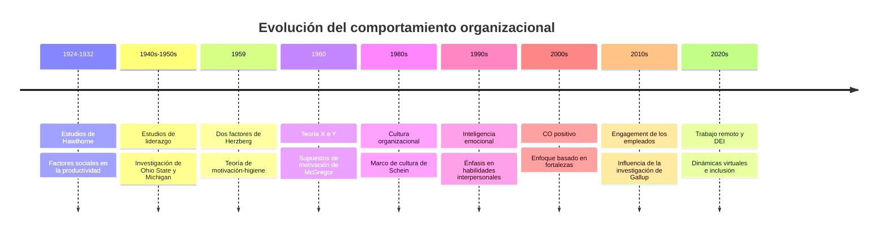

```mermaid
timeline
    title Evolución del comportamiento organizacional
    1924-1932 : Estudios de Hawthorne
              : Factores sociales en la productividad
    1940s-1950s : Estudios de liderazgo
                : Investigación de Ohio State y Michigan
    1959 : Dos factores de Herzberg
         : Teoría de motivación-higiene
    1960 : Teoría X e Y
         : Supuestos de motivación de McGregor
    1980s : Cultura organizacional
          : Marco de cultura de Schein
    1990s : Inteligencia emocional
          : Énfasis en habilidades interpersonales
    2000s : CO positivo
          : Enfoque basado en fortalezas
    2010s : Engagement de los empleados
          : Influencia de la investigación de Gallup
    2020s : Trabajo remoto y DEI
          : Dinámicas virtuales e inclusión
```
