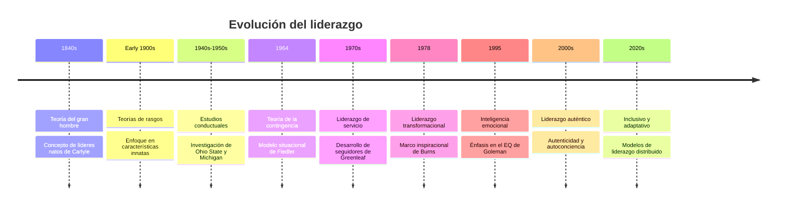

```mermaid
timeline
    title Evolución del liderazgo
    1840s : Teoría del gran hombre
          : Concepto de líderes natos de Carlyle
    Early 1900s : Teorías de rasgos
                : Enfoque en características innatas
    1940s-1950s : Estudios conductuales
                : Investigación de Ohio State y Michigan
    1964 : Teoría de la contingencia
         : Modelo situacional de Fiedler
    1970s : Liderazgo de servicio
          : Desarrollo de seguidores de Greenleaf
    1978 : Liderazgo transformacional
         : Marco inspiracional de Burns
    1995 : Inteligencia emocional
         : Énfasis en el EQ de Goleman
    2000s : Liderazgo auténtico
          : Autenticidad y autoconciencia
    2020s : Inclusivo y adaptativo
          : Modelos de liderazgo distribuido
```
