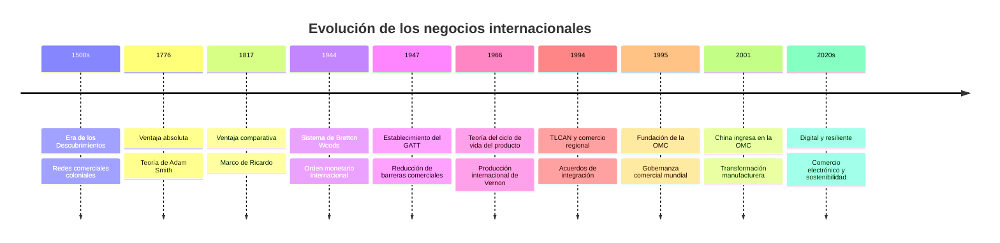

```mermaid
timeline
    title Evolución de los negocios internacionales
    1500s : Era de los Descubrimientos
          : Redes comerciales coloniales
    1776 : Ventaja absoluta
         : Teoría de Adam Smith
    1817 : Ventaja comparativa
         : Marco de Ricardo
    1944 : Sistema de Bretton Woods
         : Orden monetario internacional
    1947 : Establecimiento del GATT
         : Reducción de barreras comerciales
    1966 : Teoría del ciclo de vida del producto
         : Producción internacional de Vernon
    1994 : TLCAN y comercio regional
         : Acuerdos de integración
    1995 : Fundación de la OMC
         : Gobernanza comercial mundial
    2001 : China ingresa en la OMC
         : Transformación manufacturera
    2020s : Digital y resiliente
          : Comercio electrónico y sostenibilidad
```
