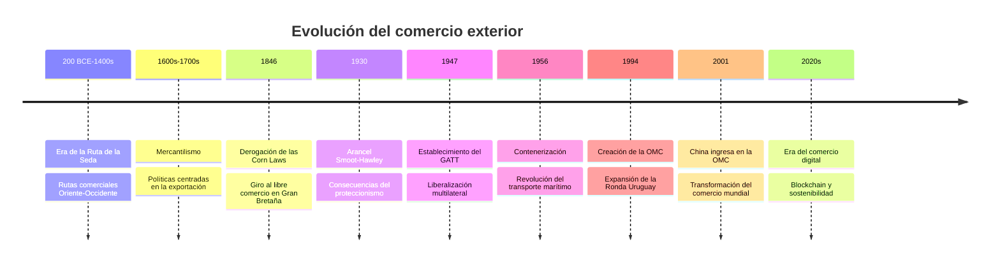

```mermaid
timeline
    title Evolución del comercio exterior
    200 BCE-1400s : Era de la Ruta de la Seda
                  : Rutas comerciales Oriente-Occidente
    1600s-1700s : Mercantilismo
                : Políticas centradas en la exportación
    1846 : Derogación de las Corn Laws
         : Giro al libre comercio en Gran Bretaña
    1930 : Arancel Smoot-Hawley
         : Consecuencias del proteccionismo
    1947 : Establecimiento del GATT
         : Liberalización multilateral
    1956 : Contenerización
         : Revolución del transporte marítimo
    1994 : Creación de la OMC
         : Expansión de la Ronda Uruguay
    2001 : China ingresa en la OMC
         : Transformación del comercio mundial
    2020s : Era del comercio digital
          : Blockchain y sostenibilidad
```
