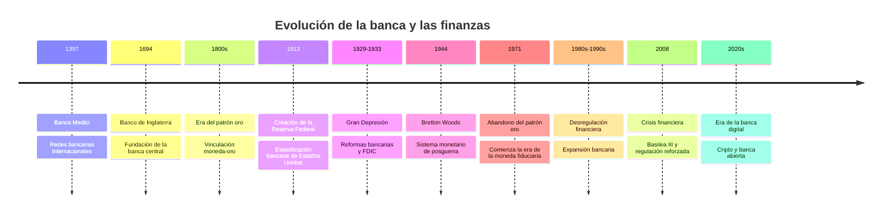

```mermaid
timeline
    title Evolución de la banca y las finanzas
    1397 : Banco Medici
         : Redes bancarias internacionales
    1694 : Banco de Inglaterra
         : Fundación de la banca central
    1800s : Era del patrón oro
          : Vinculación moneda-oro
    1913 : Creación de la Reserva Federal
         : Estabilización bancaria de Estados Unidos
    1929-1933 : Gran Depresión
              : Reformas bancarias y FDIC
    1944 : Bretton Woods
         : Sistema monetario de posguerra
    1971 : Abandono del patrón oro
         : Comienza la era de la moneda fiduciaria
    1980s-1990s : Desregulación financiera
                : Expansión bancaria
    2008 : Crisis financiera
         : Basilea III y regulación reforzada
    2020s : Era de la banca digital
          : Cripto y banca abierta
```
