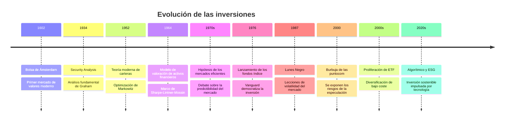

```mermaid
timeline
    title Evolución de las inversiones
    1602 : Bolsa de Ámsterdam
         : Primer mercado de valores moderno
    1934 : Security Analysis
         : Análisis fundamental de Graham
    1952 : Teoría moderna de carteras
         : Optimización de Markowitz
    1964 : Modelo de valoración de activos financieros
         : Marco de Sharpe-Lintner-Mossin
    1970s : Hipótesis de los mercados eficientes
          : Debate sobre la predictibilidad del mercado
    1976 : Lanzamiento de los fondos índice
         : Vanguard democratiza la inversión
    1987 : Lunes Negro
         : Lecciones de volatilidad del mercado
    2000 : Burbuja de las puntocom
         : Se exponen los riesgos de la especulación
    2000s : Proliferación de ETF
          : Diversificación de bajo coste
    2020s : Algorítmico y ESG
          : Inversión sostenible impulsada por tecnología
```
