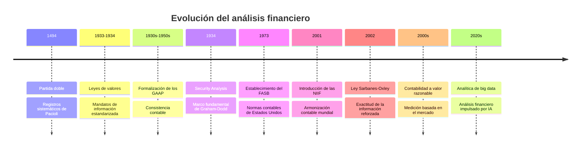

```mermaid
timeline
    title Evolución del análisis financiero
    1494 : Partida doble
         : Registros sistemáticos de Pacioli
    1933-1934 : Leyes de valores
              : Mandatos de información estandarizada
    1930s-1950s : Formalización de los GAAP
                : Consistencia contable
    1934 : Security Analysis
         : Marco fundamental de Graham-Dodd
    1973 : Establecimiento del FASB
         : Normas contables de Estados Unidos
    2001 : Introducción de las NIIF
         : Armonización contable mundial
    2002 : Ley Sarbanes-Oxley
         : Exactitud de la información reforzada
    2000s : Contabilidad a valor razonable
          : Medición basada en el mercado
    2020s : Analítica de big data
          : Análisis financiero impulsado por IA
```
