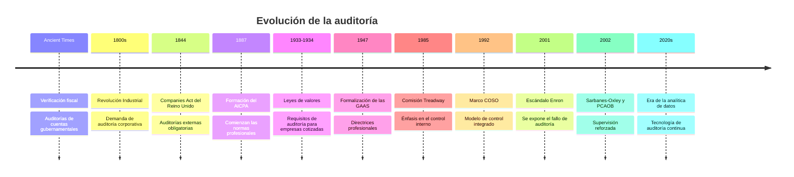

```mermaid
timeline
    title Evolución de la auditoría
    Ancient Times : Verificación fiscal
                  : Auditorías de cuentas gubernamentales
    1800s : Revolución Industrial
          : Demanda de auditoría corporativa
    1844 : Companies Act del Reino Unido
         : Auditorías externas obligatorias
    1887 : Formación del AICPA
         : Comienzan las normas profesionales
    1933-1934 : Leyes de valores
              : Requisitos de auditoría para empresas cotizadas
    1947 : Formalización de las GAAS
         : Directrices profesionales
    1985 : Comisión Treadway
         : Énfasis en el control interno
    1992 : Marco COSO
         : Modelo de control integrado
    2001 : Escándalo Enron
         : Se expone el fallo de auditoría
    2002 : Sarbanes-Oxley y PCAOB
         : Supervisión reforzada
    2020s : Era de la analítica de datos
          : Tecnología de auditoría continua
```
