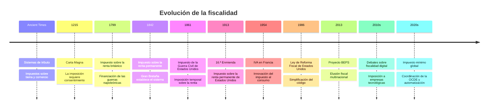

```mermaid
timeline
    title Evolución de la fiscalidad
    Ancient Times : Sistemas de tributo
                  : Impuestos sobre tierra y comercio
    1215 : Carta Magna
         : La imposición requiere consentimiento
    1799 : Impuesto sobre la renta británico
         : Financiación de las guerras napoleónicas
    1842 : Impuesto sobre la renta permanente
         : Gran Bretaña establece el sistema
    1861 : Impuesto de la Guerra Civil de Estados Unidos
         : Imposición temporal sobre la renta
    1913 : 16.ª Enmienda
         : Impuesto sobre la renta permanente de Estados Unidos
    1954 : IVA en Francia
         : Innovación del impuesto al consumo
    1986 : Ley de Reforma Fiscal de Estados Unidos
         : Simplificación del código
    2013 : Proyecto BEPS
         : Elusión fiscal multinacional
    2010s : Debates sobre fiscalidad digital
          : Imposición a empresas tecnológicas
    2020s : Impuesto mínimo global
          : Coordinación de la OCDE y automatización
```
