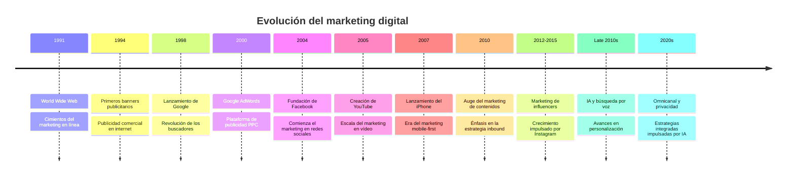

```mermaid
timeline
    title Evolución del marketing digital
    1991 : World Wide Web
         : Cimientos del marketing en línea
    1994 : Primeros banners publicitarios
         : Publicidad comercial en internet
    1998 : Lanzamiento de Google
         : Revolución de los buscadores
    2000 : Google AdWords
         : Plataforma de publicidad PPC
    2004 : Fundación de Facebook
         : Comienza el marketing en redes sociales
    2005 : Creación de YouTube
         : Escala del marketing en vídeo
    2007 : Lanzamiento del iPhone
         : Era del marketing mobile-first
    2010 : Auge del marketing de contenidos
         : Énfasis en la estrategia inbound
    2012-2015 : Marketing de influencers
              : Crecimiento impulsado por Instagram
    Late 2010s : IA y búsqueda por voz
               : Avances en personalización
    2020s : Omnicanal y privacidad
          : Estrategias integradas impulsadas por IA
```
