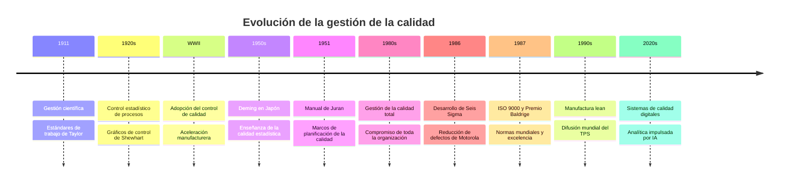

```mermaid
timeline
    title Evolución de la gestión de la calidad
    1911 : Gestión científica
         : Estándares de trabajo de Taylor
    1920s : Control estadístico de procesos
          : Gráficos de control de Shewhart
    WWII : Adopción del control de calidad
         : Aceleración manufacturera
    1950s : Deming en Japón
          : Enseñanza de la calidad estadística
    1951 : Manual de Juran
         : Marcos de planificación de la calidad
    1980s : Gestión de la calidad total
          : Compromiso de toda la organización
    1986 : Desarrollo de Seis Sigma
         : Reducción de defectos de Motorola
    1987 : ISO 9000 y Premio Baldrige
         : Normas mundiales y excelencia
    1990s : Manufactura lean
          : Difusión mundial del TPS
    2020s : Sistemas de calidad digitales
          : Analítica impulsada por IA
```
