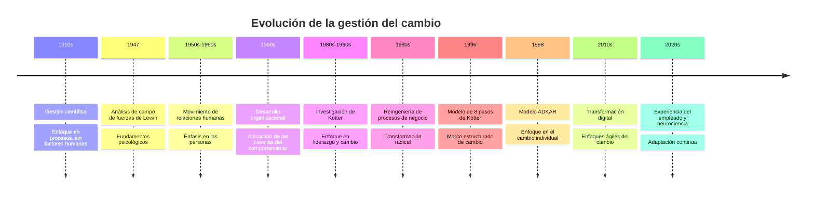

```mermaid
timeline
    title Evolución de la gestión del cambio
    1910s : Gestión científica
          : Enfoque en procesos, sin factores humanos
    1947 : Análisis de campo de fuerzas de Lewin
         : Fundamentos psicológicos
    1950s-1960s : Movimiento de relaciones humanas
                : Énfasis en las personas
    1960s : Desarrollo organizacional
          : Aplicación de las ciencias del comportamiento
    1980s-1990s : Investigación de Kotter
                : Enfoque en liderazgo y cambio
    1990s : Reingeniería de procesos de negocio
          : Transformación radical
    1996 : Modelo de 8 pasos de Kotter
         : Marco estructurado de cambio
    1998 : Modelo ADKAR
         : Enfoque en el cambio individual
    2010s : Transformación digital
          : Enfoques ágiles del cambio
    2020s : Experiencia del empleado y neurociencia
          : Adaptación continua
```
