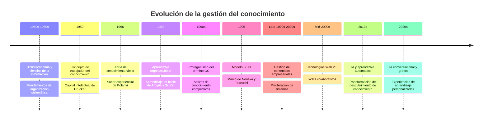

```mermaid
timeline
    title Evolución de la gestión del conocimiento
    1950s-1960s : Biblioteconomía y ciencias de la información
                : Fundamentos de organización sistemática
    1959 : Concepto de trabajador del conocimiento
         : Capital intelectual de Drucker
    1966 : Teoría del conocimiento tácito
         : Saber experiencial de Polanyi
    1978 : Aprendizaje organizacional
         : Aprendizaje en bucle de Argyris y Schön
    1990s : Protagonismo del término GC
          : Activos de conocimiento competitivos
    1995 : Modelo SECI
         : Marco de Nonaka y Takeuchi
    Late 1990s-2000s : Gestión de contenidos empresariales
                     : Proliferación de sistemas
    Mid-2000s : Tecnologías Web 2.0
              : Wikis colaborativos
    2010s : IA y aprendizaje automático
          : Transformación del descubrimiento de conocimiento
    2020s : IA conversacional y grafos
          : Experiencias de aprendizaje personalizadas
```
