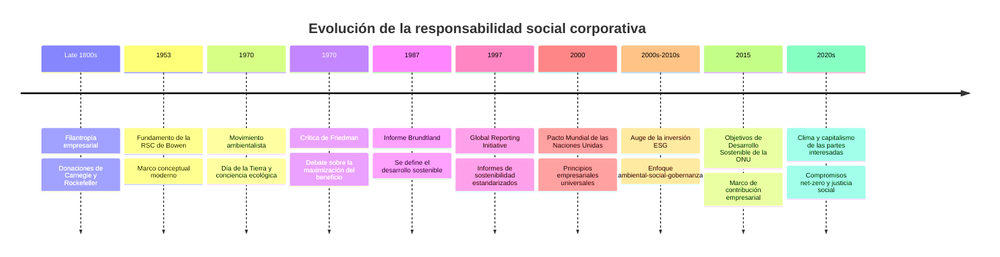

```mermaid
timeline
    title Evolución de la responsabilidad social corporativa
    Late 1800s : Filantropía empresarial
               : Donaciones de Carnegie y Rockefeller
    1953 : Fundamento de la RSC de Bowen
         : Marco conceptual moderno
    1970 : Movimiento ambientalista
         : Día de la Tierra y conciencia ecológica
    1970 : Crítica de Friedman
         : Debate sobre la maximización del beneficio
    1987 : Informe Brundtland
         : Se define el desarrollo sostenible
    1997 : Global Reporting Initiative
         : Informes de sostenibilidad estandarizados
    2000 : Pacto Mundial de las Naciones Unidas
         : Principios empresariales universales
    2000s-2010s : Auge de la inversión ESG
                : Enfoque ambiental-social-gobernanza
    2015 : Objetivos de Desarrollo Sostenible de la ONU
         : Marco de contribución empresarial
    2020s : Clima y capitalismo de las partes interesadas
          : Compromisos net-zero y justicia social
```
