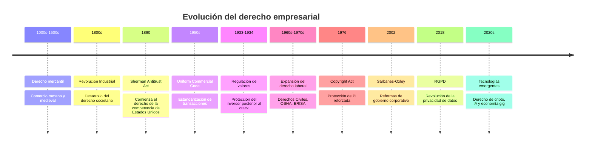

```mermaid
timeline
    title Evolución del derecho empresarial
    1000s-1500s : Derecho mercantil
                : Comercio romano y medieval
    1800s : Revolución Industrial
          : Desarrollo del derecho societario
    1890 : Sherman Antitrust Act
         : Comienza el derecho de la competencia de Estados Unidos
    1950s : Uniform Commercial Code
          : Estandarización de transacciones
    1933-1934 : Regulación de valores
              : Protección del inversor posterior al crack
    1960s-1970s : Expansión del derecho laboral
                : Derechos Civiles, OSHA, ERISA
    1976 : Copyright Act
         : Protección de PI reforzada
    2002 : Sarbanes-Oxley
         : Reformas de gobierno corporativo
    2018 : RGPD
         : Revolución de la privacidad de datos
    2020s : Tecnologías emergentes
          : Derecho de cripto, IA y economía gig
```
