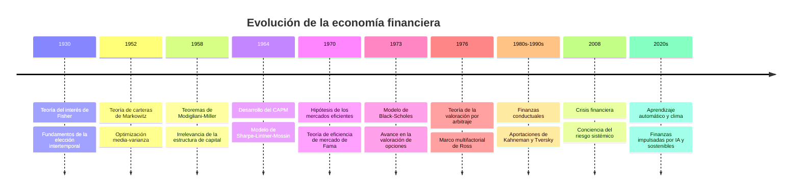

```mermaid
timeline
    title Evolución de la economía financiera
    1930 : Teoría del interés de Fisher
         : Fundamentos de la elección intertemporal
    1952 : Teoría de carteras de Markowitz
         : Optimización media-varianza
    1958 : Teoremas de Modigliani-Miller
         : Irrelevancia de la estructura de capital
    1964 : Desarrollo del CAPM
         : Modelo de Sharpe-Lintner-Mossin
    1970 : Hipótesis de los mercados eficientes
         : Teoría de eficiencia de mercado de Fama
    1973 : Modelo de Black-Scholes
         : Avance en la valoración de opciones
    1976 : Teoría de la valoración por arbitraje
         : Marco multifactorial de Ross
    1980s-1990s : Finanzas conductuales
                : Aportaciones de Kahneman y Tversky
    2008 : Crisis financiera
         : Conciencia del riesgo sistémico
    2020s : Aprendizaje automático y clima
          : Finanzas impulsadas por IA y sostenibles
```
