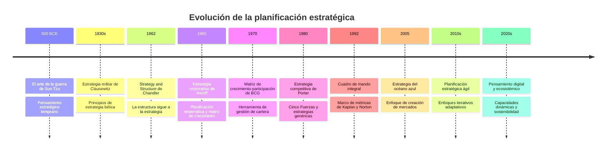

```mermaid
timeline
    title Evolución de la planificación estratégica
    500 BCE : El arte de la guerra de Sun Tzu
            : Pensamiento estratégico temprano
    1830s : Estrategia militar de Clausewitz
          : Principios de estrategia bélica
    1962 : Strategy and Structure de Chandler
         : La estructura sigue a la estrategia
    1965 : Estrategia corporativa de Ansoff
         : Planificación sistemática y matriz de crecimiento
    1970 : Matriz de crecimiento-participación de BCG
         : Herramienta de gestión de cartera
    1980 : Estrategia competitiva de Porter
         : Cinco Fuerzas y estrategias genéricas
    1992 : Cuadro de mando integral
         : Marco de métricas de Kaplan y Norton
    2005 : Estrategia del océano azul
         : Enfoque de creación de mercados
    2010s : Planificación estratégica ágil
          : Enfoques iterativos adaptativos
    2020s : Pensamiento digital y ecosistémico
          : Capacidades dinámicas y sostenibilidad
```
