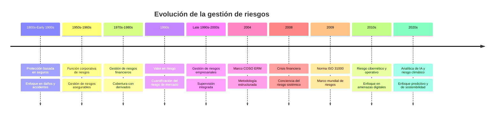

```mermaid
timeline
    title Evolución de la gestión de riesgos
    1800s-Early 1900s : Protección basada en seguros
                      : Enfoque en daños y accidentes
    1950s-1960s : Función corporativa de riesgos
                : Gestión de riesgos asegurables
    1970s-1980s : Gestión de riesgos financieros
                : Cobertura con derivados
    1990s : Valor en riesgo
          : Cuantificación del riesgo de mercado
    Late 1990s-2000s : Gestión de riesgos empresariales
                     : Supervisión integrada
    2004 : Marco COSO ERM
         : Metodología estructurada
    2008 : Crisis financiera
         : Conciencia del riesgo sistémico
    2009 : Norma ISO 31000
         : Marco mundial de riesgos
    2010s : Riesgo cibernético y operativo
          : Enfoque en amenazas digitales
    2020s : Analítica de IA y riesgo climático
          : Enfoque predictivo y de sostenibilidad
```
