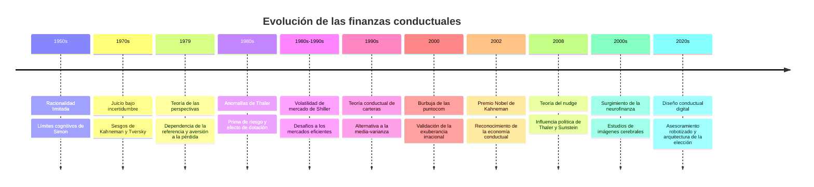

```mermaid
timeline
    title Evolución de las finanzas conductuales
    1950s : Racionalidad limitada
          : Límites cognitivos de Simon
    1970s : Juicio bajo incertidumbre
          : Sesgos de Kahneman y Tversky
    1979 : Teoría de las perspectivas
         : Dependencia de la referencia y aversión a la pérdida
    1980s : Anomalías de Thaler
          : Prima de riesgo y efecto de dotación
    1980s-1990s : Volatilidad de mercado de Shiller
                : Desafíos a los mercados eficientes
    1990s : Teoría conductual de carteras
          : Alternativa a la media-varianza
    2000 : Burbuja de las puntocom
         : Validación de la exuberancia irracional
    2002 : Premio Nobel de Kahneman
         : Reconocimiento de la economía conductual
    2008 : Teoría del nudge
         : Influencia política de Thaler y Sunstein
    2000s : Surgimiento de la neurofinanza
          : Estudios de imágenes cerebrales
    2020s : Diseño conductual digital
          : Asesoramiento robotizado y arquitectura de la elección
```
