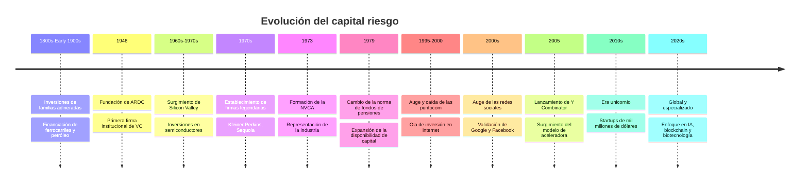

```mermaid
timeline
    title Evolución del capital riesgo
    1800s-Early 1900s : Inversiones de familias adineradas
                      : Financiación de ferrocarriles y petróleo
    1946 : Fundación de ARDC
         : Primera firma institucional de VC
    1960s-1970s : Surgimiento de Silicon Valley
                : Inversiones en semiconductores
    1970s : Establecimiento de firmas legendarias
          : Kleiner Perkins, Sequoia
    1973 : Formación de la NVCA
         : Representación de la industria
    1979 : Cambio de la norma de fondos de pensiones
         : Expansión de la disponibilidad de capital
    1995-2000 : Auge y caída de las puntocom
              : Ola de inversión en internet
    2000s : Auge de las redes sociales
          : Validación de Google y Facebook
    2005 : Lanzamiento de Y Combinator
         : Surgimiento del modelo de aceleradora
    2010s : Era unicornio
          : Startups de mil millones de dólares
    2020s : Global y especializado
          : Enfoque en IA, blockchain y biotecnología
```
