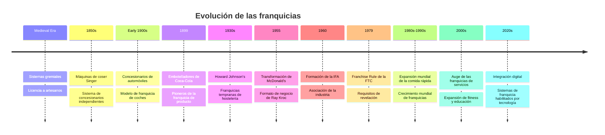

```mermaid
timeline
    title Evolución de las franquicias
    Medieval Era : Sistemas gremiales
                 : Licencia a artesanos
    1850s : Máquinas de coser Singer
          : Sistema de concesionarios independientes
    Early 1900s : Concesionarios de automóviles
                : Modelo de franquicia de coches
    1899 : Embotelladores de Coca-Cola
         : Pioneros de la franquicia de producto
    1930s : Howard Johnson's
          : Franquicias tempranas de hostelería
    1955 : Transformación de McDonald's
         : Formato de negocio de Ray Kroc
    1960 : Formación de la IFA
         : Asociación de la industria
    1979 : Franchise Rule de la FTC
         : Requisitos de revelación
    1980s-1990s : Expansión mundial de la comida rápida
                : Crecimiento mundial de franquicias
    2000s : Auge de las franquicias de servicios
          : Expansión de fitness y educación
    2020s : Integración digital
          : Sistemas de franquicia habilitados por tecnología
```
