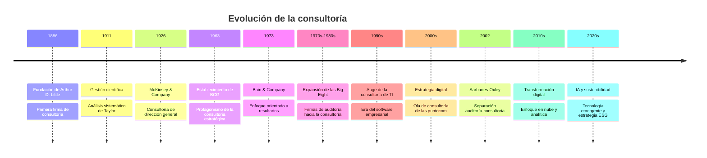

```mermaid
timeline
    title Evolución de la consultoría
    1886 : Fundación de Arthur D. Little
         : Primera firma de consultoría
    1911 : Gestión científica
         : Análisis sistemático de Taylor
    1926 : McKinsey & Company
         : Consultoría de dirección general
    1963 : Establecimiento de BCG
         : Protagonismo de la consultoría estratégica
    1973 : Bain & Company
         : Enfoque orientado a resultados
    1970s-1980s : Expansión de las Big Eight
                : Firmas de auditoría hacia la consultoría
    1990s : Auge de la consultoría de TI
          : Era del software empresarial
    2000s : Estrategia digital
          : Ola de consultoría de las puntocom
    2002 : Sarbanes-Oxley
         : Separación auditoría-consultoría
    2010s : Transformación digital
          : Enfoque en nube y analítica
    2020s : IA y sostenibilidad
          : Tecnología emergente y estrategia ESG
```
