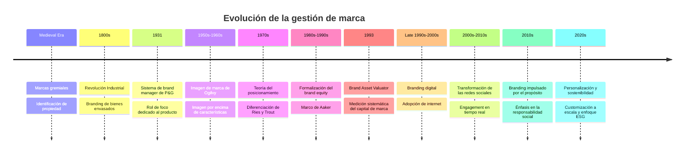

```mermaid
timeline
    title Evolución de la gestión de marca
    Medieval Era : Marcas gremiales
                 : Identificación de propiedad
    1800s : Revolución Industrial
          : Branding de bienes envasados
    1931 : Sistema de brand manager de P&G
         : Rol de foco dedicado al producto
    1950s-1960s : Imagen de marca de Ogilvy
                : Imagen por encima de características
    1970s : Teoría del posicionamiento
          : Diferenciación de Ries y Trout
    1980s-1990s : Formalización del brand equity
                : Marco de Aaker
    1993 : Brand Asset Valuator
         : Medición sistemática del capital de marca
    Late 1990s-2000s : Branding digital
                     : Adopción de internet
    2000s-2010s : Transformación de las redes sociales
                : Engagement en tiempo real
    2010s : Branding impulsado por el propósito
          : Énfasis en la responsabilidad social
    2020s : Personalización y sostenibilidad
          : Customización a escala y enfoque ESG
```
