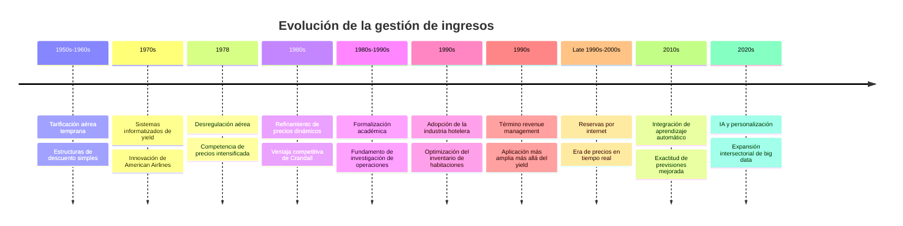

```mermaid
timeline
    title Evolución de la gestión de ingresos
    1950s-1960s : Tarificación aérea temprana
                : Estructuras de descuento simples
    1970s : Sistemas informatizados de yield
          : Innovación de American Airlines
    1978 : Desregulación aérea
         : Competencia de precios intensificada
    1980s : Refinamiento de precios dinámicos
          : Ventaja competitiva de Crandall
    1980s-1990s : Formalización académica
                : Fundamento de investigación de operaciones
    1990s : Adopción de la industria hotelera
          : Optimización del inventario de habitaciones
    1990s : Término revenue management
          : Aplicación más amplia más allá del yield
    Late 1990s-2000s : Reservas por internet
                     : Era de precios en tiempo real
    2010s : Integración de aprendizaje automático
          : Exactitud de previsiones mejorada
    2020s : IA y personalización
          : Expansión intersectorial de big data
```
